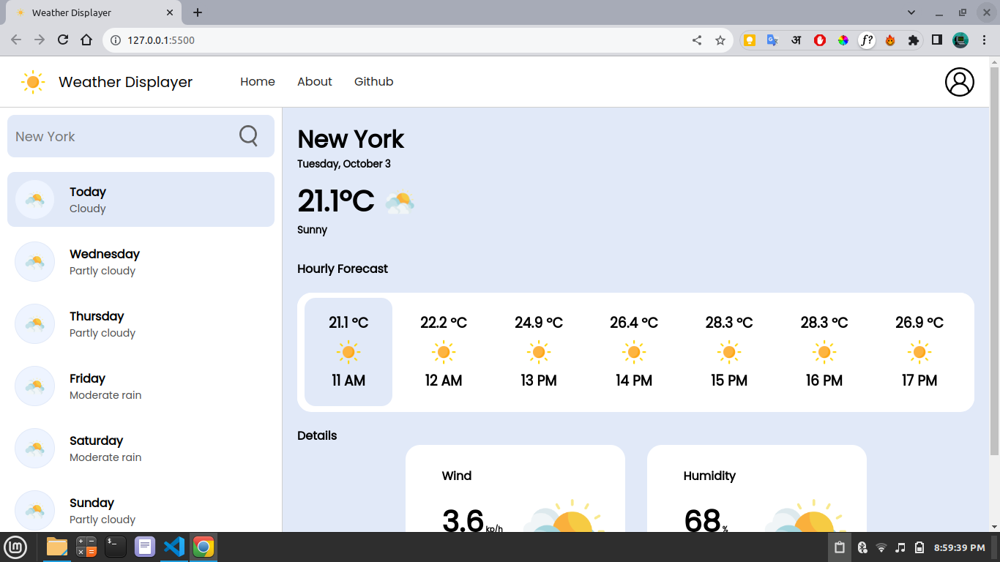

# Weather App

## Description
This weather app, created by manoj-098 and Gauravst, provides real-time weather information for a given location using WeatherAPI.com's API. Users can easily check the current weather conditions, as well as forecasts for the upcoming days. It's a simple and user-friendly tool to stay updated on the weather no matter where you are.

## Features
- Get current weather information for any location.
- View weather forecasts for the next 7 days.
- Detailed weather data including temperature, humidity, wind speed, and more.
- Search for weather data by city name or coordinates (latitude and longitude).
- Responsive design for a seamless user experience on desktop and mobile devices.

## Screenshots


## Technologies Used
- HTML5
- CSS3
- JavaScript
- WeatherAPI.com's API

## Installation
1. Clone the repository to your local machine using `git clone`.
2. Open `index.html` in your web browser.

## Usage
1. Enter the name of a city in the search bar.
2. Click the "Search" button or press Enter.
3. The current weather and 7-day forecast for the specified location will be displayed.

## API Key
To use this app, you will need to sign up for a free API key from [WeatherAPI.com](https://www.weatherapi.com/). Once you have the API key, replace `'YOUR_API_KEY'` in the `script.js` file with your actual API key.

```javascript
const apiKey = 'YOUR_API_KEY';
```

## License
This project is licensed under the MIT License - see the LICENSE file for details.

## Acknowledgments
We would like to thank WeatherAPI.com for providing the weather data used in this application.

## Contributors
[<br /><sub><a href="https://github.com/Gauravst">Gauravst</a></sub>](https://github.com/Gauravst/repository)

[<br /><sub><a href="https://github.com/manoj-098">manoj-098</a></sub>](https://github.com/manoj-098/repository)


Feel free to contribute to this project by creating issues or submitting pull requests!

